<div align="center">

<picture>
  <source media="(prefers-color-scheme: light)" srcset="./assets/hero-light.svg">
  
</picture>

<br/>

<picture>
  <source media="(prefers-color-scheme: light)" srcset="./assets/typing-light.svg">
  
</picture>

<br/>

<picture>
  <source media="(prefers-color-scheme: light)" srcset="./assets/badges-light.svg">
  
</picture>

<br/>

<a href="https://github.com/Aadrit1234"></a>
<a href="mailto:aadritchandravanci23@gmail.com"></a>
<a href="https://www.linkedin.com/in/aadrit-chandravanci"></a>

<br/>
<br/>


<br/>

<picture>
  <source media="(prefers-color-scheme: light)" srcset="./assets/mark-light.svg">
  
</picture>

</div>

<br/>

## `> whoami`

```text
$ aadrit --intro
┌──────────────────────────────────────────────────────────┐
│  Aadrit · Full-Stack Engineer · Offensive Security · AI/ML
│  Building products that actually ship.                   │
└──────────────────────────────────────────────────────────┘
```

I build complete products end to end — the frontend, the backend, the
infrastructure, and the parts nobody demos. My interest spans full-stack
engineering, offensive security research, and applied AI/ML, with a habit of
reverse engineering anything I use.

Most of my work lands as a deployed product rather than a demo: a file
conversion engine that preserves layout, an offline study app for JEE and CBSE
students, a self-hosted print server, an E2E-encrypted collaboration suite, and
a prompt-engineering tool that runs against five different AI backends.

<br/>

<picture>
  <source media="(prefers-color-scheme: light)" srcset="./assets/terminal-light.svg">
  
</picture>

<br/>

## `> stack`

<table>
<tr><td width="50%" valign="top">

**Languages &amp; Runtimes**

```text
JavaScript · TypeScript · Python · HTML · CSS
Node.js · Bun · Vite · React · Fastify · Postgres
Docker · Make · Bash
```

**Frontend**

- React 19 + Vite 8, TypeScript end to end
- Framer Motion for motion, Tailwind for layout discipline
- Three.js via `@react-three/fiber` — real 3D, not sprites

**Backend &amp; Infra**

- Fastify APIs, Postgres, WebRTC peer-to-peer transfer
- E2E encryption with keys that never leave the client
- Docker, Makefiles, self-hosted services on Raspberry Pi and local hardware

</td><td width="50%" valign="top">

**AI / ML**

- LLM apps across five providers: OpenRouter, Gemini, Anthropic, Ollama, local
- Prompt engineering as a discipline — constraints, output format, edge cases
- Bring-your-own-key architectures; user keys never touch a server
- Retrieval and structured generation for study and tooling products

**Security**

- Offensive research: reverse engineering, protocol analysis, exploitation
- E2E encryption design for real-time collaboration
- Security-conscious defaults: nothing administrative reachable over the network
- Self-hosted infrastructure with real access control and licence gating

**Tooling**

- Vite, Playwright, Postman, VS Code
- Linux, Proxmox, Tailscale
- CI via GitHub Actions

</td></tr>
</table>

<br/>

<picture>
  <source media="(prefers-color-scheme: light)" srcset="./assets/orbit3d-light.svg">
  
</picture>

<br/>

## `> projects`

<table>
<tr>
<td width="50%" valign="top" align="center">

<a href="https://github.com/Aadrit1234/filemorph"><picture><source media="(prefers-color-scheme: light)" srcset="./assets/project-filemorph-light.svg"></picture></a>

[**filemorph**](https://github.com/Aadrit1234/filemorph) ·
[Live](https://filemorph-dusky.vercel.app)

Free online file converter and audio transcriber. Converts documents, images and
audio between formats with full content preservation — every pixel, table, font
and image stays where it belongs. LibreOffice, pdf2docx and Sharp, plus
English/Hindi audio transcription.

</td>
<td width="50%" valign="top" align="center">

<a href="https://github.com/Aadrit1234/FormulaVault"><picture><source media="(prefers-color-scheme: light)" srcset="./assets/project-FormulaVault-light.svg"></picture></a>

[**FormulaVault**](https://github.com/Aadrit1234/FormulaVault) ·
[Live](https://formulav.vercel.app)

Offline-first study app for CBSE Class 11/12 and JEE. 833 formula cards across 62
chapters with a typo-tolerant universal search, printable revision sheets, and a
teaching AI tutor that runs on your own free API key. Zero frameworks, zero build
step.

</td>
</tr>
<tr>
<td width="50%" valign="top" align="center">

<a href="https://github.com/Aadrit1234/printbridge"><picture><source media="(prefers-color-scheme: light)" srcset="./assets/project-printbridge-light.svg"></picture></a>

[**printbridge**](https://github.com/Aadrit1234/printbridge) ·
[Live](https://print-pi-three.vercel.app)

Self-hosted print server for workspaces and shops. Upload from anywhere, preview
exactly what prints, then print on a Wi-Fi or USB printer unattended. Two public
sites, one printer, three desktop apps for the machine, the shop and the client.

</td>
<td width="50%" valign="top" align="center">

<a href="https://github.com/Aadrit1234/conduit"><picture><source media="(prefers-color-scheme: light)" srcset="./assets/project-conduit-light.svg"></picture></a>

[**conduit**](https://github.com/Aadrit1234/conduit) ·
[Live](https://conduit-liard.vercel.app)

End-to-end encrypted real-time collaboration rooms. Ephemeral or permanent
spaces for chat, file and folder sharing, and WebRTC peer-to-peer transfer.
Vite + React 19 + Fastify + Postgres.

</td>
</tr>
<tr>
<td width="100%" valign="top" align="center">

<a href="https://github.com/Aadrit1234/prompt-forge"><picture><source media="(prefers-color-scheme: light)" srcset="./assets/project-prompt-forge-light.svg"></picture></a>

[**prompt-forge**](https://github.com/Aadrit1234/prompt-forge) ·
[Live](https://prompt-forge-beige-ten.vercel.app)

Describe the task, get the prompt that actually works. Applies real
prompt-engineering techniques — role and context binding, explicit constraints,
output format, edge-case handling — only where they genuinely help. Five AI
backends with per-request model selection.

</td>
</tr>
</table>

<br/>

<picture>
  <source media="(prefers-color-scheme: light)" srcset="./assets/timeline-light.svg">
  
</picture>

<br/>

## `> telemetry`

<br/>

<picture>
  <source media="(prefers-color-scheme: light)" srcset="./assets/card-light.svg">
  
</picture>

<br/>

<picture>
  <source media="(prefers-color-scheme: light)" srcset="./assets/pulse-light.svg">
  
</picture>

<br/>

<picture>
  <source media="(prefers-color-scheme: light)" srcset="./assets/matrix-light.svg">
  
</picture>

<br/>

## `> 3d`

<br/>

<table>
<tr>
<td width="33%" valign="top" align="center">

<picture>
  <source media="(prefers-color-scheme: light)" srcset="./assets/cube3d-light.svg">
  
</picture>

**Cube** — 3D wireframe rotation rendered as animated SVG paths

</td>
<td width="33%" valign="top" align="center">

<picture>
  <source media="(prefers-color-scheme: light)" srcset="./assets/globe-light.svg">
  
</picture>

**Globe** — a projected sphere with meridian and latitude loops

</td>
<td width="33%" valign="top" align="center">

<picture>
  <source media="(prefers-color-scheme: light)" srcset="./assets/scene-light.svg">
  
</picture>

**Scene** — three projected solids, depth-sorted per frame

</td>
</tr>
</table>

<br/>

## `> notes`

- Everything animated in this README is **generated SVG** — no JavaScript, no
  external fonts, no tracking pixels. The 3D pieces are real perspective
  projections baked into path data, so they animate inside GitHub's renderer.
- Dark and light variants are separate assets, switched with
  `<picture>` + `prefers-color-scheme`, so the profile matches your theme.
- The build pipeline lives in `scripts/` — run `node scripts/build.mjs` to
  regenerate every asset from live GitHub data, then
  `node scripts/probe.mjs assets` to validate them in a real browser.
- The contribution grid above is generated by
  [Platane/snk](https://github.com/Platane/snk) on a nightly schedule.

<br/>

<picture>
  <source media="(prefers-color-scheme: light)" srcset="./assets/waves-light.svg">
  
</picture>

<br/>

<picture>
  <source media="(prefers-color-scheme: light)" srcset="./assets/footer-light.svg">
  
</picture>

<br/>

<div align="center">

**Thanks for visiting.** Built with too much attention to detail.

[](https://github.com/Aadrit1234)
[](mailto:aadritchandravanci23@gmail.com)
[](https://www.linkedin.com/in/aadrit-chandravanci)

</div>
