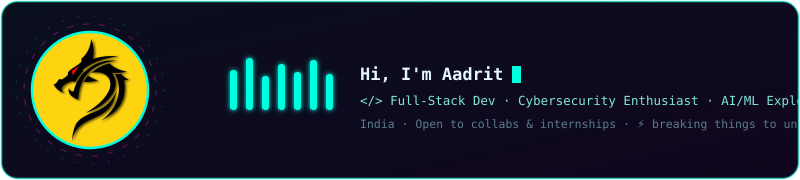

<!-- ═══════════════════════════════════════════════════════════════════
     AADRIT — CYBER/NEON GITHUB PROFILE  v2.0
     Hand-built animated profile · SVG-native animations (GitHub-safe)
     ═══════════════════════════════════════════════════════════════════ -->

## 

I build secure, resilient, intelligent systems — **and break them first to understand them deeply.**
Currently deep in **full-stack engineering**, **ethical hacking**, and **AI/ML experiments**.

- 🔭 Currently building: **AI-powered developer tools** & **encrypted realtime apps**
- 🌱 Leveling up in: **advanced web exploitation & ML systems**
- 💬 Ask me about: **web security, Node/React, Python automation, LLM apps**
- ⚡ Fun fact: *the best debugger is a threat model*

 

## ⚡ 

---

### 🛰️ MISSION CONTROL — LIVE TELEMETRY

 

### 🏆 ACHIEVEMENTS UNLOCKED

---

### 🧬 TECH STACK — ARSENAL

  
   
  

 

  
  
  
  
  
  
  
  

 

  
  
  
  
  
  

 

### 🗂️ SPOTLIGHTED BUILDS

| Project | Description | Tech |
|---|---|---|
| **[prompt-forge](https://github.com/Aadrit1234/prompt-forge)** | Describe the task, get the prompt that actually works. Five AI backends, per-request model selection. | `JS` `AI` `APIs` |
| **[conduit](https://github.com/Aadrit1234/conduit)** | E2E-encrypted realtime collaboration rooms — chat + WebRTC file transfer. | `TS` `WebRTC` `Postgres` |
| **[FormulaVault](https://github.com/Aadrit1234/FormulaVault)** | Offline-first study app: 833 formula cards, typo-tolerant search, AI tutor. | `HTML` `PWA` `AI` |
| **[filemorph](https://github.com/Aadrit1234/filemorph)** | Free online file converter & audio transcriber with full content preservation. | `CSS` `Node` `LibreOffice` |
| **[printbridge](https://github.com/Aadrit1234/printbridge)** | Self-hosted print server: upload anywhere, print unattended over Wi-Fi/USB. | `JS` `Self-hosted` |

 

### 🕹️ CONTRIBUTION ANIMATION

 

### 🌌 3D CONTRIBUTION PLANET

 

### 🧠 QUOTES THAT COMPILE

  

 

  
  

 

