

 

 

## 🖥️ Stack Preview

  

## 🧭 Stack Map

  

## 🛠️ Full Stack

### 🌐 Languages

  
  
  
  
  
  
  
  
  
  
  
  
  
  
  
  
  

### 🎨 Frontend

  
  
  
  
  
  
  
  
  
  
  
  
  
  
  
  
  
  
  
  
  
  

### ⚙️ Backend & API

  
  
  
  
  
  
  
  
  
  
  
  
  
  
  
  

### 🗄️ Data & Storage

  
  
  
  
  
  
  
  
  
  

### 🖥️ Desktop & Mobile

  
  
  
  
  
  

### ☁️ Cloud, DevOps & Tools

  
  
  
  
  
  
  
  
  
  
  
  
  

### 🤖 AI & Data Science

  
  
  
  
  
  
  
  
  

### 🧰 Workflow & Design

  
  
  
  
  
  
  
  
  
  
  
  

## 🧠 About

<table>
<tr>
<td valign="top" width="55%">

**Hey, I'm Aadrit.** I turn ideas into real, working software — from zero-dependency study apps to encrypted realtime collaboration rooms and self-hosted print infrastructure.

- 🌐 **Full-stack** — web, desktop, realtime and everything between
- 🧠 **Curious by default** — I pick up new languages, frameworks and tools fast
- 🔒 **Privacy-first** — offline-first storage, E2E encryption, no tracking
- ⚡ **Ship it** — small tools I actually use beat big projects I never finish
- 🎨 **Creative tech** — 3D, motion design, WebGL, shaders and weird experiments
- 🤖 **AI-native** — building with local models, prompt engineering and agentic tooling

</td>
<td valign="top" width="45%">

<pre>
  ╭─────────────────────────────╮
  │  ❯ whoami                    │
  │                             │
  │  name    Aadrit             │
  │  role    Full-Stack Dev    │
  │  stack   TS · React · Node │
  │  mode    Always shipping   │
  │  status  ● building             │
  │  fuel    ▲ coffee + curiosity  │
  ╰─────────────────────────────╯
</pre>

</td>
</tr>
</table>

## 🚀 Featured Projects

  

<table>
<tr>
<td valign="top" width="50%">

### 🔗 [conduit](https://github.com/Aadrit1234/conduit)

**End-to-end encrypted realtime rooms.** Chat, folders and file transfer inside ephemeral or permanent rooms. Server-backed realtime with client-side E2E encryption and WebRTC peer-to-peer transfer. Animated 3D hero with a morphing core, particle network and mouse parallax.

</td>
<td valign="top" width="50%">

### 🖨️ [printbridge](https://github.com/Aadrit1234/printbridge)

**Self-hosted print infrastructure.** Two public sites, one printer, three desktop apps. Send a document from any device, get a token number, collect it at the machine — unattended. Pricing, expenses, revenue and licences, all with the backend at home.

</td>
</tr>
<tr>
<td valign="top">

### 🧮 [FormulaVault](https://github.com/Aadrit1234/FormulaVault)

**Offline-first study app.** 833 formula cards across 62 chapters for CBSE 11/12 and JEE Main & Advanced. Typo-tolerant universal search, AI tutor with your own API key, flashcards with mastery tracking, printable revision sheets and smart calculators. Zero frameworks, zero build step.

</td>
<td valign="top">

### 🧪 [prompt-forge](https://github.com/Aadrit1234/prompt-forge) · [filemorph](https://github.com/Aadrit1234/filemorph)

**Prompt engineering & file conversion.** `prompt-forge` — plain language in, a genuinely structured prompt out, with five AI backends, depth control and a techniques report. `filemorph` — free document, image and audio conversion with full fidelity preserved.

</td>
</tr>
</table>

## 📊 Stats

 

 

## 📈 Contribution Activity

 

<picture>
  <source media="(prefers-color-scheme: dark)" srcset="https://raw.githubusercontent.com/Aadrit1234/Aadrit1234/output/github-contribution-grid-snake-dark.svg"/>
  <source media="(prefers-color-scheme: light)" srcset="https://raw.githubusercontent.com/Aadrit1234/Aadrit1234/output/github-contribution-grid-snake.svg"/>
  
</picture>

## 🧩 What I Like Building

<table>
<tr>
<td align="center" width="25%"><b>🌐 Web</b> Modern sites, dashboards & full-stack apps</td>
<td align="center" width="25%"><b>📱 Mobile</b> Cross-platform apps that just work</td>
<td align="center" width="25%"><b>🖥️ Desktop</b> Utilities, tools & Electron/Tauri apps</td>
<td align="center" width="25%"><b>🎨 Creative Tech</b> 3D, motion, graphics & experiments</td>
</tr>
<tr>
<td align="center" width="25%"><b>🔐 Privacy</b> E2E encryption & offline-first data</td>
<td align="center" width="25%"><b>⚡ Realtime</b> Sockets, WebRTC & live collaboration</td>
<td align="center" width="25%"><b>🧰 Tooling</b> Self-hosted infra that runs at home</td>
<td align="center" width="25%"><b>🎓 Learning</b> Study tools & knowledge systems</td>
</tr>
<tr>
<td align="center" width="25%"><b>🤖 AI Native</b> Local models, agents & prompt craft</td>
<td align="center" width="25%"><b>🎮 Game Dev</b> Godot, shaders & WebGL experiments</td>
<td align="center" width="25%"><b>☁️ Self-Hosted</b> Docker, tunnels & home servers</td>
<td align="center" width="25%"><b>⚙️ Systems</b> Rust, Go & performance work</td>
</tr>
</table>

## 🎯 Current Focus

<table>
<tr><td width="160"><b>Building</b></td><td>Realtime collaboration, encrypted rooms &amp; WebRTC transfer</td></tr>
<tr><td width="160"><b>Learning</b></td><td>Systems design, Rust, shaders and WebGPU</td></tr>
<tr><td width="160"><b>Experimenting</b></td><td>Local-first sync, tiny models, agentic workflows</td></tr>
<tr><td width="160"><b>Shipping</b></td><td>PrintBridge &amp; FormulaVault releases</td></tr>
</table>

## 📫 Let's Connect

  

**Open to interesting problems, open-source collaboration, and anything that ships.**

⚡ Code. Create. Learn. Repeat.

