 

 

## 🖥️ Stack Preview

  

<h3 align="left">I build across the whole stack —</h3>

  
  
  
  
  
  

  
  
  
  
  
  

  
  
  
  
  
  

  
  
  
  
  
  

## 🧠 About

<table>
<tr>
<td valign="top" width="55%">

**Hey, I'm Aadrit.** I turn ideas into real, working software — from zero-dependency study apps to encrypted realtime collaboration rooms and self-hosted print infrastructure.

- 🌐 **Full-stack** — web, desktop, and everything between
- 🧠 **Curious by default** — I pick up new languages, frameworks and tools fast
- 🔒 **Privacy-first** — offline-first storage, E2E encryption, no tracking
- ⚡ **Ship it** — small tools I actually use beat big projects I never finish
- 🎨 **Creative tech** — 3D, motion design, WebGL, and weird experiments

</td>
<td valign="top" width="45%">

<pre>
     ╭──────────────────────────╮
     │  &gt; whoami               │
     │                          │
     │  name     Aadrit        │
     │  role     Full-Stack    │
     │  mode     Always        │
     │           shipping      │
     │  status   ● building    │
     ╰──────────────────────────╯
</pre>

</td>
</tr>
</table>

## 🚀 Featured Projects

  

<table>
<tr>
<td valign="top" width="50%">

### 🔗 [conduit](https://github.com/Aadrit1234/conduit)
**End-to-end encrypted realtime rooms**

Chat, folders and file transfer inside ephemeral or permanent rooms. Server-backed realtime with client-side E2E encryption and WebRTC peer-to-peer transfer.

</td>
<td valign="top" width="50%">

### 🖨️ [printbridge](https://github.com/Aadrit1234/printbridge)
**Self-hosted print infrastructure**

Two public sites, one printer, three desktop apps. Send a document from any device, get a token, collect it at the machine — unattended.

</td>
</tr>
<tr>
<td valign="top">

### 🧮 [FormulaVault](https://github.com/Aadrit1234/FormulaVault)
**Offline-first study app**

833 formula cards across 62 chapters for CBSE 11/12 and JEE. Typo-tolerant search, AI tutor, flashcards, revision sheets, smart calculators. Zero frameworks, zero build step.

</td>
<td valign="top">

### 🧪 [prompt-forge](https://github.com/Aadrit1234/prompt-forge) · [filemorph](https://github.com/Aadrit1234/filemorph)
**Prompt engineering & file conversion**

`prompt-forge` — plain language in, a genuinely structured prompt out. Five AI backends, depth control, a techniques report. `filemorph` — free document, image and audio conversion with full fidelity.

</td>
</tr>
</table>

## 📊 Stats

 

## 📈 Contribution Activity

 

<picture>
  <source media="(prefers-color-scheme: dark)" srcset="https://raw.githubusercontent.com/Aadrit1234/Aadrit1234/output/github-contribution-grid-snake-dark.svg"/>
  <source media="(prefers-color-scheme: light)" srcset="https://raw.githubusercontent.com/Aadrit1234/Aadrit1234/output/github-contribution-grid-snake.svg"/>
  
</picture>

## 🧩 What I Like Building

<table>
<tr>
<td align="center" width="25%"><b>🌐 Web</b> Modern sites, dashboards & full-stack apps</td>
<td align="center" width="25%"><b>📱 Mobile</b> Cross-platform apps that just work</td>
<td align="center" width="25%"><b>🖥️ Desktop</b> Utilities, tools & Electron/Tauri apps</td>
<td align="center" width="25%"><b>🎨 Creative Tech</b> 3D, motion, graphics & experiments</td>
</tr>
<tr>
<td align="center" width="25%"><b>🔐 Privacy</b> E2E encryption & offline-first data</td>
<td align="center" width="25%"><b>⚡ Realtime</b> Sockets, WebRTC & live collaboration</td>
<td align="center" width="25%"><b>🧰 Tooling</b> Self-hosted infra that runs at home</td>
<td align="center" width="25%"><b>🎓 Learning</b> Study tools & knowledge systems</td>
</tr>
</table>

## 🎯 Current Focus

<table>
<tr><td width="150"><b>Building</b></td><td>Realtime collaboration & encrypted rooms</td></tr>
<tr><td width="150"><b>Learning</b></td><td>Systems design, Rust, and shaders</td></tr>
<tr><td width="150"><b>Experimenting</b></td><td>WebGPU, local-first sync, tiny AI models</td></tr>
<tr><td width="150"><b>Shipping</b></td><td>PrintBridge & FormulaVault releases</td></tr>
</table>

## 📫 Let's Connect

  

**Open to interesting problems, open-source collaboration, and anything that ships.**

⚡ Code. Create. Learn. Repeat.

